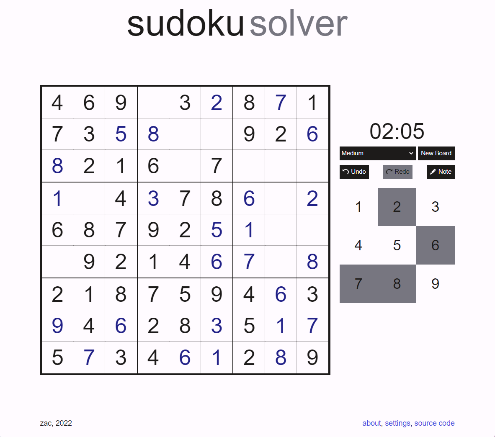

# sudoku

a simple sudoku game and solver, built using Vite + React + TypeScript  
try it out at [zaccnz.github.io/sudoku](https://zaccnz.github.io/sudoku/) 

### screenshots



### getting start
if you would like to host this application yourself...
```
git clone https://github.com/zaccnz/sudoku.git
cd sudoku
npm install
npm run dev
```

### features

- sudoku board generator
- multiple difficulty levels
- undo and redo buttons
- note potential values

### technologies

- [Vite](https://vitejs.dev/)
- [React](https://reactjs.org/)
- [TypeScript](https://www.typescriptlang.org/)
- [react-confetti](https://github.com/alampros/react-confetti)
- [react-icons](https://react-icons.github.io/react-icons/)
- [gh-pages](https://github.com/tschaub/gh-pages)
- [typescript-plugin-css-modules](https://github.com/mrmckeb/typescript-plugin-css-modules)

